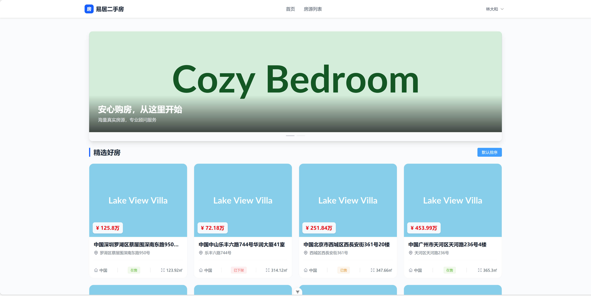
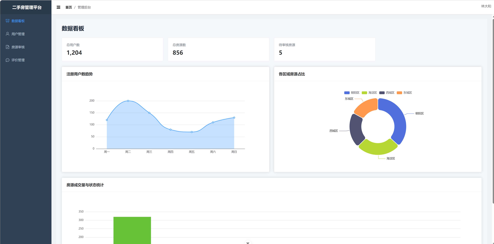
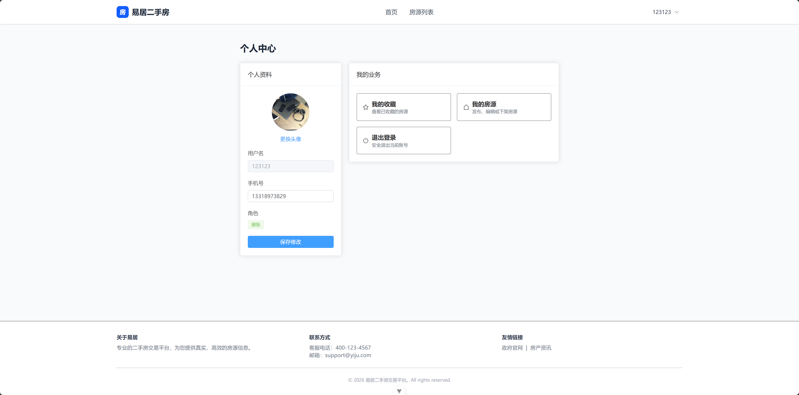

# 🏠 二手房信息交易平台 - 前端项目
# 

|  |  |  |
| :----------------------------------------------------------: | :----------------------------------------------------------: | :----------------------------------------------------------: |
|                           房源首页                           |                          管理员后台                          |                           个人中心                           |


本项目是一个基于现代化 Vue3 技术栈开发的二手房信息交易平台前端应用。系统采用前后端分离架构，旨在为购房者、房东及管理员提供高效、流畅的房源浏览、发布管理及数据监控体验。
> 如有项目定制需求请联系微信:traffic_zhang
- **核心架构**：Vue3 (Composition API) + Vite
- **状态管理**：Pinia
- **UI 组件库**：ElementPlus
- **可视化**：ECharts (管理端)
- **网络请求**：Axios + 拦截器
- **路由方案**：Vue Router

---

## 📚 目录结构

本项目遵循模块化设计原则，目录结构清晰，便于维护与扩展。

```bash
src/
├── api/                    # 接口请求封装，按模块划分 (auth, house, admin)
├── assets/                 # 静态资源 (图片、样式)
├── components/             # 通用业务组件 (如: HouseCard, ImageUploader)
├── composables/            # 组合式函数 (逻辑复用，如 useFetch)
├── router/                 # 路由配置与守卫 (含权限校验)
├── store/                  # Pinia 状态管理 (用户信息、收藏状态)
├── styles/                 # 全局样式与 SCSS 变量覆盖
├── utils/                  # 工具类 (如: token处理, 表单验证规则)
├── views/                  # 页面视图
│   ├── home/               # 首页 (轮播、推荐)
│   ├── house/              # 房源模块 (列表、详情、发布向导)
│   ├── user/               # 用户中心 (个人资料、我的收藏)
│   └── admin/              # 管理后台 (看板、审核、管理)
└── App.vue                 # 根组件
└── main.js                 # 入口文件
